 

 

<table>
<tr>
<td width="50%" valign="top">

<h3>&gt; ./profissional.sh</h3>

<b>[ TRAJETÓRIA ]</b>
<ul>
  <li><b>Desenvolvedor</b> – DSI/UFVJM Sistemas institucionais, acessibilidade e suporte de infraestrutura.</li>
  <li><b>Dev Frontend</b> – Next Step (Empresa Júnior) Interfaces web com foco em UX/UI.</li>
  <li><b>Membro pesquisador</b> – Liga ByteBuilders Robótica e programação em C/C++.</li>
</ul>

<b>[ FORMAÇÃO E CERTIFICAÇÕES ]</b>
<ul>
  <li>Sistemas de Informação – UFVJM</li>
  <li>Aspire Leaders Program – Aspire Institute</li>
  <li>CompTIA PenTest+ – ESR/RNP</li>
  <li>Ethical Hacker e Intro to Cybersecurity – Cisco</li>
  <li>Hackers do Bem – Básico (64h)</li>
  <li>Cibersegurança: Ataques Cibernéticos – USP</li>
</ul>

<b>[ STACK ]</b>
<ul>
  <li><code>Python</code> <code>C</code> <code>C++</code> <code>Java</code> <code>JavaScript</code> <code>PHP/Laravel</code> <code>Apex</code></li>
  <li><code>React</code> <code>HTML5</code> <code>CSS3</code> <code>Bootstrap</code></li>
  <li><code>PostgreSQL</code> <code>MySQL</code> <code>SQLite</code></li>
  <li><code>Linux</code> <code>Docker</code> <code>Kubernetes</code> <code>Git</code></li>
</ul>

</td>
<td width="50%" valign="top">

<h3>&gt; ./pessoal.sh --lab</h3>

  <!-- Troque por o seu GIF: ./assets/galinha.gif -->
  

<b>[ PROJETOS DE LABORATÓRIO ]</b>
<ul>
  <li><b>Engenharia reversa de SNES</b> ROM de Brain Lord com Ghidra, Assembly e debug em emuladores.</li>
  <li><b>Kali NetHunter no Redmi Note 9</b> Kernel MediaTek 4.14 customizado, bootloader, TWRP e Magisk.</li>
  <li><b>Análise de malware</b> WannaCry (EternalBlue) e Trojan MEMZ em VMs isoladas.</li>
  <li><b>Portfólio pessoal</b> Dark/Light mode e múltiplos idiomas.</li>
</ul>

<b>[ IDIOMAS ]</b>
<ul>
  <li>Português: nativo</li>
  <li>Inglês: avançado (C1)</li>
  <li>Japonês: iniciante (A2), curso IsF/UnB concluído</li>
</ul>

<b>[ INTERESSES ]</b>
<ul>
  <li>Retro gaming (SNES)</li>
  <li>Android modding</li>
  <li>Segurança ofensiva</li>
  <li>Programação de baixo nível</li>
</ul>

</td>
</tr>
</table>

 

  
  

